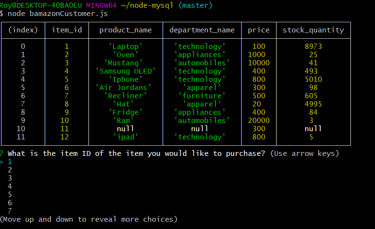
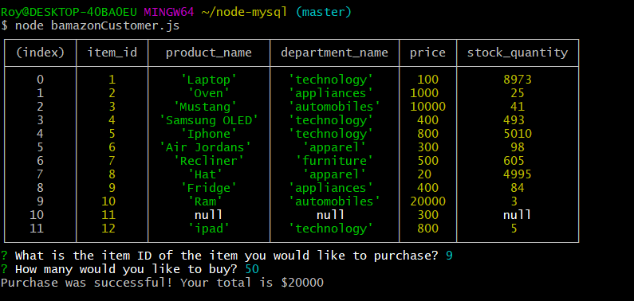
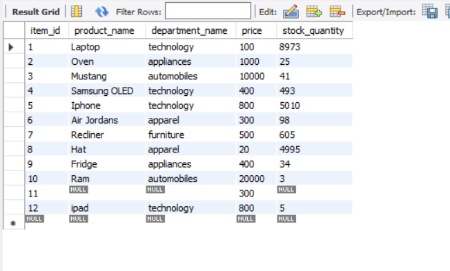
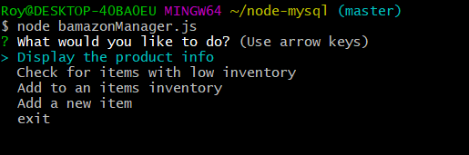
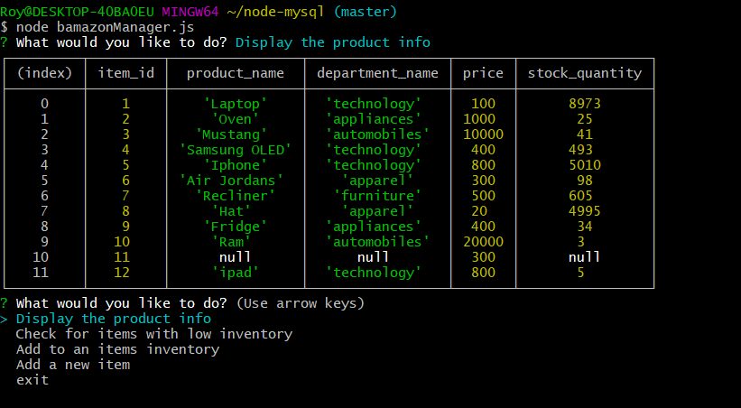
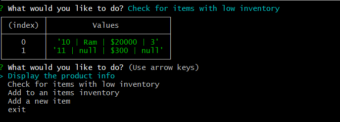
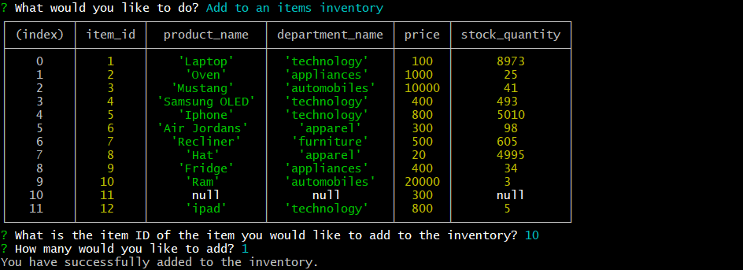
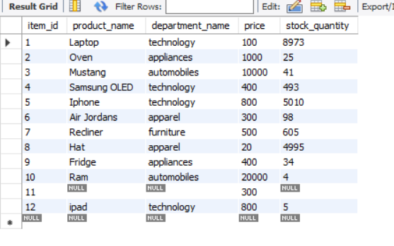
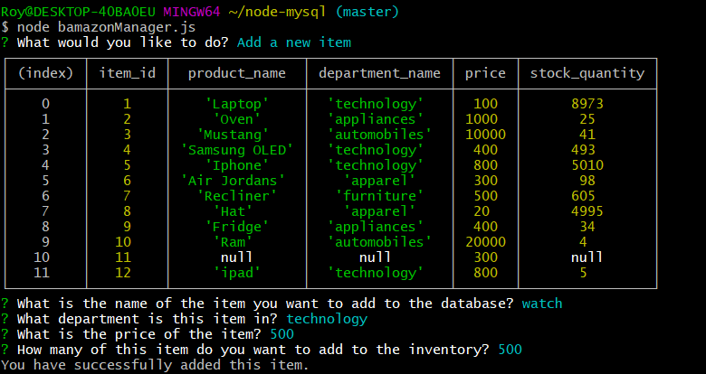
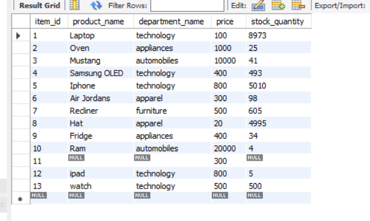

# node-mysql

# Bamazon App

### Overview

In this assignment we were tasked with building a Bamazon app. This app allows users to preview items for sale or purchase an item from the list of available items that are stored in a mysql database we created. The second part of the assignment was to create some manager functions to all the manager to keep tabs on the "business".

### Customer option to buy items

To access the following prompts you must type node bamazonCustomer.js

#### Screenshot of this process

##### How it works

To use this function you just arrow to the number that represents the item id that you want to purchase.

You are then asked how many of that item you would like to purchase and it then tells you that your purchase was successful and how much the total is.

In this screenshot you can see that the mysql database has been updated as now "Fridge" has 34 units available after the purchase of the 50 units.

### Manager search commands

To access these option you must enter node bamazonManager.js

* Display the product info
* Check for items with low inventory
* Add to an items inventory
* Add a new item

#### Display the product info

This option just logs a table for all the items in the database with their information

You then use the arrow key to navigate to the option you want. This example we use Display the product info.

#### Check for items with low inventory

This option accesses the mysql database and returns any item that has a quantity of less than 5 on hand.

#### Add to an items inventory

This option allows the manager to add to any items inventory in the mysql database.

You are prompted to type in the item id of the item you want to add to the inventory of. You are then prompted how many would you like to add.

We can now see the Ram item has had 1 unit added to the stock quantity.

#### Add a new item

This command allows the manager to add a new item to the database.

The prompts ask you the name of the item, the department the item belongs, the price of the item, and the quantity of the item to be added.

Now when you load up the mysql database you can see that the new item watch is in there with all the info we provided.

